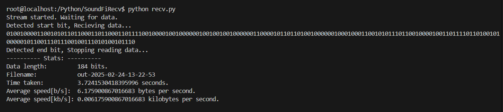

# Sound-Fi

It's like Wi-Fi. But with sound.

## About:

A very crude implementation for transferring data over sound. A encoder, and a decoder.

## Encoder:

Reads in a file and creates audio samples for each bit, and plays/saves the final audio file using SFML/Audio.

## Decoder:

Performs fft on the input audio and detects what bits are being played, if any. Adds up all bits together and outputs it to a file.

## Usage:

### Encoder:

Set the file paths in the `main()` function, and run the program.

### Decoder:

Start the python script `recv.py` after installing all the packages. The script starts listening for data. As soon as it detects the data transfer start beep it starts adding the bits together. When it detects the data transfer end beep it stops adding the bits together and outputs the data to a file.

## Possible improvements:

-   More robust start and end detection.
-   Transfer a whole byte in one go instead of one bit at a time using multiple frequencies.
-   Make the program more user friendly.
-   Transfer metadata along with the file like file name, size etc.
-   On the fly samples generation using sample streams for large files on the encoder.
